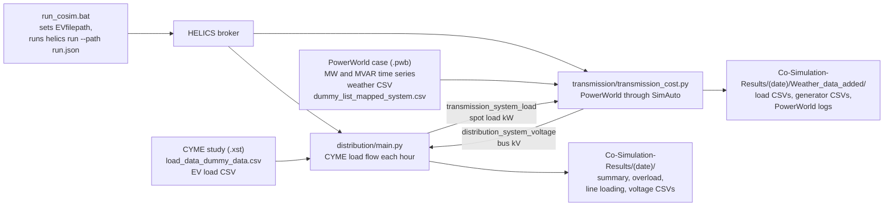

# T-D_Co-Simulation
# Set-up Enviroment
The provided environment.yml file can be used to create a new “environment” that includes all the required dependencies for running the custom scripts. Two examples for creating this new environment—named “cympyEnv” here—are provided below:
Example directly in Python: python -m venv c:\path\to\environment.yml
Example with Anaconda Python: conda env create --name cympyEnv --file=c:\path\to\environment.yml
Once the cympyEnv has been created, it must be activated before running any of the custom scripts.
# Importing the CymPy Package
After creating and activating the cympyEnv, the steps below can be used to import the CymPy package:
1. Create a text file called “cympy.pth” that contains the path to the parent folder where the CymPy library is located (e.g., “C:\Program Files\CYME\CYME_9_4_rev01”). An example is provided.
2. Place “cympy.pth” in the “site-packages” folder of the cympyEnv environment (e.g., “C:\Users\...\Anaconda3\envs\cympyEnv\Lib\site-packages”)
3. Include “import cympy” at the top of any Python script for which the package will be used.

# Running the  Co-Simulation

- **Change any file reference to reflect their locations on your system (all folders not provided here should be placed in the main Co-Simulation Folder**
- **Change the directory in the Anaconda Prompt to the project location**
- **Run the simulation using the batch file (The file locations inside the batch files must be changed to match your system path)(Batch files can be edited with any text editor)**
```
cd CoSim Directory 
run_cosim.bat 
```

<!-- Sections below were added on 2026-09-27. The original text above is unchanged. -->

## Overview

This repository runs an hourly transmission and distribution (T&D) co-simulation with HELICS. One federate, `distribution/main.py`, runs CYME load flows through the `cympy` API. The other, `transmission/transmission_cost.py`, drives a PowerWorld Simulator case through SimAuto. Each hour the distribution side publishes the kW of every CYME spot load, and the transmission side publishes bus voltages (kV) for a list of mapped substations. The loop covers hours 1 to 24, and the distribution side writes CYME summary, overload and voltage reports at the end.

## How it works



What the code does, in order:

1. `run_cosim.bat` sets the `EVfilepath` environment variable and runs `helics run --path run.json`. This starts a broker and the two federates from the repository root. Both federates use a ZMQ core (see [`helics_utils/`](helics_utils/README.md)).
2. Each hour, `distribution/main.py` runs a CYME load flow, reads `TotalKW` for every spot load, and publishes the list on `transmission_system_load`.
3. Each hour, `transmission/transmission_cost.py` reads `BusKVVolt` for the loads at each substation number in `dummy_list_mapped_system.csv`. It then sets load MW and MVAR from that hour's column of the time-series files, sets `GenMWMax` for the generators listed in the weather file, and publishes the voltages it read on `distribution_system_voltage`.
4. The transmission side passes the received values to `update_power()`, which adds each value to `LoadMW` of one load at the substation in the same list position, writes the load table to CSV and solves the power flow. The script then saves the PowerWorld log and generator data. As committed, the `update_power()` call fails in hour 1 (see Known issues).
5. The distribution side prints the voltages it receives. The current code does not write them into the CYME model. It also reads the EV load file named by `EVfilepath` and prints the hourly EV total, but does not add that total to the CYME loads.
6. After hour 24, `distribution/main.py` writes its report CSVs once, labelled `X24`. It does this only if the last voltage string it received contains a comma (a vector of two or more values).

## Repository layout

| Folder | What it contains | Main contributor (git history) | Start here |
|---|---|---|---|
| [`distribution/`](distribution/README.md) | CYME distribution federate, CYME report helpers, a placeholder hourly load table | Diana Wallison | `main.py` |
| [`helics_utils/`](helics_utils/README.md) | Small HELICS value-federate wrapper imported by both federates | Diana Wallison | `__init__.py` |
| [`transmission/`](transmission/README.md) | PowerWorld transmission federate, its helper functions, a local copy of the ESA `SAW` class | Diana Wallison | `transmission_cost.py` |

Files in the repository root (all added by Diana Wallison):

| File | What it is |
|---|---|
| `run_cosim.bat` | Sets `EVfilepath`, runs `helics run --path run.json`, then `helics kill-all-brokers` |
| `run.json` | HELICS runner configuration: a broker and the two federates |
| `environment.yml` | Conda environment export named `cympyEnv` (Python 3.12.7, Windows package builds) |
| `cympy.pth` | Example path file that points Python at the CYME install folder |
| `10_simulation_output_combined_remap_D_Loads.csv` | EV load table read through `EVfilepath`: columns `Node Name`, `X1` to `X24`, `D Sub`; 21,997 rows |
| `dummy_list_mapped_system.csv` | Substation mapping list: columns `Area`, `T Sub`, `D Sub`, `ID`, `Longitude`, `Latitude`, `Substation Number`, `Substation Name`; 1,841 rows. The transmission federate uses `Substation Number`. |

## Setup

The steps in the sections above still apply. These details were checked against the code.

1. Use a Windows PC. The scripts build paths with backslashes, and the PowerWorld link uses Windows COM.
2. Install CYME with its Python API (`cympy`) for the distribution federate.
3. Install PowerWorld Simulator with SimAuto for the transmission federate. The code drives it through the `SAW` class in `transmission/saw_editing_file.py`, which uses `pywin32`.
4. Create the conda environment from the repository root in an Anaconda Prompt: `conda env create -f environment.yml`, then `conda activate cympyEnv`. `environment.yml` is a conda file (Python 3.12.7). The `python -m venv` example above does not read it.
5. Install the packages the code imports that `environment.yml` does not list: `pip install networkx dss-python OpenDSSDirect.py`.
6. Edit `cympy.pth` so it holds your CYME folder (the example contains `C:\Program Files\CYME\CYME`), and copy it into `...\envs\cympyEnv\Lib\site-packages`. `distribution/main.py` and `distribution/cyme_functions.py` also run `import _db`. That module is not in this repository or in `environment.yml`, so it must be importable in the same environment.
7. Put the model files the scripts expect in place (see Inputs and outputs), or edit the file names in the scripts.
8. Edit the hard-coded paths: `EVfilepath` in `run_cosim.bat`, the distribution `exec` line in `run.json` (see Known issues), and `studyFilename` in `distribution/main.py` if your CYME study has another name.

## Running

From an Anaconda Prompt with `cympyEnv` active, start in the repository root:

```
cd <path to>\T-D_Co-Simulation
run_cosim.bat
```

`run.json` launches both federates with `"directory": "."`, so the scripts run with the repository root as the working directory. Without the batch file:

```
set EVfilepath=C:\full\path\to\10_simulation_output_combined_remap_D_Loads.csv
helics run --path run.json
helics kill-all-brokers
```

Settings at the top of the two federate scripts:

| Script | Variable | Value in the repository | Effect |
|---|---|---|---|
| `distribution/main.py` | `system` | `"EV"` | `"base"` does not run as written (see [`distribution/`](distribution/README.md)) |
| `distribution/main.py` | `date` | `'May 3'` | Name of the output folder under `Co-Simulation-Results` |
| `distribution/main.py` | `duration` | `25` | Hours 1 to 24 |
| `transmission/transmission_cost.py` | `date` | `'Aug. 6'` | Selects the time-series and weather files and the output folder |
| `transmission/transmission_cost.py` | `weather` | `True` | Applies the weather file and puts the OPF and generator outputs under `Weather_data_added`. The weather file is read and the logs go to `Weather_data_added` whatever the value. |
| `transmission/transmission_cost.py` | `pw_file` | `Texas7k_20221101_WithPFWModels_loadscaledmidnight.pwb` | PowerWorld case, read from `transmission/` |

The two scripts set `date` separately, and the committed values differ.

`python distribution\cyme_functions.py` (run from the repository root) is a separate CYME test script. It opens the same CYME study and writes two test CSVs into `distribution/`.

## Inputs and outputs

Inputs in the repository:

- `10_simulation_output_combined_remap_D_Loads.csv`: read by `distribution/main.py` through `EVfilepath`. Only its hourly total is used, and only for printing.
- `dummy_list_mapped_system.csv`: the `Substation Number` column is read by `transmission/transmission_cost.py`.
- `distribution/load_data_dummy_data.csv`: 16 node IDs with placeholder values for hours 1 to 24, read by `distribution/main.py`.

Inputs not in the repository (file names are hard-coded):

- `distribution/testing_cyme_fullbonnet_file_10_net.xst` (CYME study).
- `transmission/Texas7k_20221101_WithPFWModels_loadscaledmidnight.pwb` (PowerWorld case).
- `transmission/MWtimeseries_Aug. 6.csv` and `transmission/MVARtimeseries_Aug. 6.csv` (hourly load columns `X1` to `X24`).
- `transmission/weather/renewable_generation_Aug. 6.csv` (columns `DateTime`, `GenNamepw`, `MaxMW` are used).

Files with the four transmission names are in EV-Research-Simulations (see Related repositories).

Outputs, under `Co-Simulation-Results\` in the repository root:

- `distribution/main.py`, once after hour 24, in `Co-Simulation-Results\May 3\`: `Summary\summary_X24.csv`, `Overload Summary\overload_summary_by_network_X24.csv`, `Overload Summary\overload_summary_by_source_X24.csv`, `Overloads\all_overloads_X24.csv`, `Overloads\line_loading_X24.csv`, `Voltages\all_voltages_X24.csv`. These are written only if the last received voltage string contains a comma. These folders must exist before the run.
- `distribution/main.py` also writes `test.csv` (spot load kW and kvar totals, overwritten each hour) to the working directory.
- `transmission/transmission_cost.py`, each hour, in `Co-Simulation-Results\Aug. 6\Weather_data_added\`: `OPF\opf_load_data_X<hour>.csv` (the load table after the distribution values are added; the folder is named OPF, but the active code solves a power flow), `log<hour>.txt` and `log_after<hour>.txt` (PowerWorld log), and `Generator_data\generator_data_hour_X<hour>.csv`. The script creates these folders. As committed, the run stops before these files are written (see Known issues).

## Known issues

- `run.json` starts the distribution federate with `python distribution_system/main.py`, but the folder in this repository is `distribution/`. Change that line to `python distribution/main.py --loglevel=7`.
- `run_cosim.bat` sets `EVfilepath` to a path on the author's `D:` drive. `distribution/main.py` stops with a `KeyError` if `EVfilepath` is not set.
- `environment.yml` does not include `networkx` (imported by `transmission/saw_editing_file.py`), or `dss-python` and `OpenDSSDirect.py` (imported as `dss` and `opendssdirect` by `distribution/main.py`). Both federates fail at import without them.
- `transmission_cost.py` calls `update_power(pw, P, IDs, opf_file)` with four arguments, but `update_power()` in `transmission/power_world_setup.py` takes nine. The transmission federate stops with a `TypeError` in hour 1, after it receives the first load vector.
- `distribution/main.py` does not create its output folders. Each `if not <folder>:` test checks a non-empty string, so `os.makedirs` never runs. Create the folders under `Co-Simulation-Results\<date>\` first.
- `update_load()` in `distribution/main.py` does not apply the hourly values from `load_data_dummy_data.csv` (details in [`distribution/`](distribution/README.md)).

## Related repositories

- [EV-Research-Simulations](https://github.com/OverbyeResearchGroup/EV-Research-Simulations), folder `Full-Co-Simulation/`: same federate layout (`distribution_system/`, `helics_utils/`, `transmission/`, `run.json`). `transmission/saw_editing_file.py` here is identical to `Full-Co-Simulation/transmission/updated_esa_functions.py` there. `distribution/power_world_setup.py` is identical to `Full-Co-Simulation/distribution_system/power_world_setup.py`. `helics_utils/__init__.py` differs by one commented-out line. `transmission/transmission_cost.py` and `transmission/power_world_setup.py` are edited versions; for example, both import `SAW` from `saw_editing_file` instead of `esa`. That folder also holds the PowerWorld case, MW and MVAR time-series files and weather files named in `transmission_cost.py`.
- [ESA](https://github.com/mzy2240/ESA) (the `esa` package on PyPI): `transmission/saw_editing_file.py` contains ESA's `SAW` class, and its docstrings link to that repository.

## Contributors

From the git history:

- Diana Wallison: 29 commits
- Jonathan Snodgrass: 1 commit (initial commit)

## Status

- First commit 2025-09-03; last commit 2025-12-17.
- `distribution/main.py` and `distribution/cyme_functions.py` were changed through 2025-12-17 and hold the most recent work.
- `transmission/` was last changed on 2025-10-07 and `helics_utils/` on 2025-10-06. `run.json` dates from 2025-10-06, `run_cosim.bat` from 2025-10-07, and `environment.yml` and `cympy.pth` from 2025-10-20.
